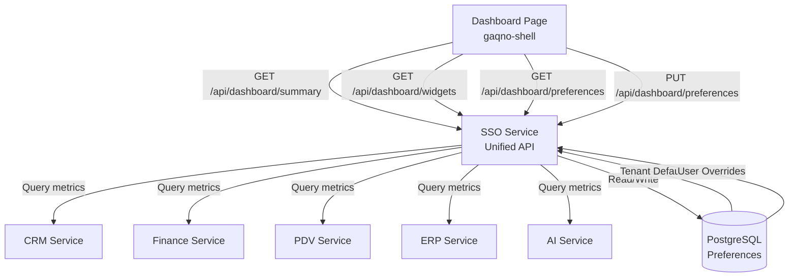

<!-- 047ba9fc-fb38-42a8-b97c-d393bbc3deaf 451af4ea-398b-4584-b237-18f67327e863 -->
# Customizable Dashboard Implementation

## Overview

Transform the dashboard into a customizable widget-based system that shows service-specific metrics (CRM, Finance, PDV, ERP, AI) and cross-service aggregated data. Users can toggle widgets on/off and reorder them via drag-and-drop. Preferences are saved per-user with tenant defaults.

## Architecture

## Implementation Steps

### Phase 1: Database Schema (SSO Service)

**File: `gaqno-sso-service/src/database/schema.ts`**

- Add `dashboard_preferences` table:
  - `id` (uuid, primary key)
  - `userId` (uuid, nullable - null = tenant default)
  - `tenantId` (uuid, required)
  - `widgets` (jsonb) - array of widget configs: `[{id, type, position, visible, config}]`
  - `layout` (jsonb) - grid layout configuration
  - `createdAt`, `updatedAt` timestamps
  - Unique index on `(userId, tenantId)` where userId is not null
  - Index on `tenantId` for tenant defaults lookup

**File: `gaqno-sso-service/src/database/migrations/XXXX_dashboard_preferences.sql`**

- Create migration SQL for new table

### Phase 2: Dashboard Service (SSO Service)

**File: `gaqno-sso-service/src/dashboard/dashboard.module.ts`**

- Create dashboard module with HttpModule for service calls

**File: `gaqno-sso-service/src/dashboard/dashboard.service.ts`**

- `getAvailableWidgets(userPermissions: string[])` - Returns widgets based on permissions
- `getDashboardSummary(userId: string, tenantId: string)` - Aggregates data from all services
- `getUserPreferences(userId: string, tenantId: string)` - Gets user preferences with tenant fallback
- `saveUserPreferences(userId: string, tenantId: string, preferences: DashboardPreferences)` - Saves user preferences
- `saveTenantDefaults(tenantId: string, preferences: DashboardPreferences)` - Saves tenant defaults
- Private methods to query each service:
  - `fetchCrmMetrics(tenantId: string)` - Calls `http://crm:3004/api/dashboard/metrics`
  - `fetchFinanceMetrics(tenantId: string)` - Calls `http://finance-service:3006/api/dashboard/metrics`
  - `fetchPdvMetrics(tenantId: string)` - Calls `http://pdv-service:4012/api/dashboard/metrics`
  - `fetchErpMetrics(tenantId: string)` - Calls `http://erp:3005/api/dashboard/metrics`
  - `fetchAiMetrics(tenantId: string)` - Calls `http://ai-service:3003/api/dashboard/metrics`
- `aggregateCrossServiceMetrics(serviceMetrics: ServiceMetrics[])` - Calculates totals, trends, etc.

**File: `gaqno-sso-service/src/dashboard/dashboard.controller.ts`**

- `GET /api/dashboard/widgets` - Returns available widgets for user
- `GET /api/dashboard/summary` - Returns aggregated dashboard data
- `GET /api/dashboard/preferences` - Returns user preferences (with tenant fallback)
- `PUT /api/dashboard/preferences` - Saves user preferences
- `PUT /api/dashboard/preferences/tenant` - Saves tenant defaults (admin only)

**File: `gaqno-sso-service/src/dashboard/dto/dashboard-preferences.dto.ts`**

- `DashboardPreferencesDto` - Validation for preferences payload
- `WidgetConfigDto` - Validation for widget configuration
- `LayoutConfigDto` - Validation for layout configuration

### Phase 3: Service Dashboard Endpoints

Each service needs a `/api/dashboard/metrics` endpoint that returns service-specific metrics.

**CRM Service** (`gaqno-crm` - if exists as backend, otherwise frontend):

- Total contacts, active deals, pipeline value, recent activity

**Finance Service** (`gaqno-finance-service`):

- Total balance, monthly income/expenses, recent transactions, account summaries

**PDV Service** (`gaqno-pdv-service`):

- Today's sales, top products, recent transactions, inventory alerts

**ERP Service** (`gaqno-erp` - if exists as backend):

- Orders count, inventory levels, pending shipments, recent orders

**AI Service** (`gaqno-ai-service`):

- Books created, characters generated, recent activity, usage stats

### Phase 4: Frontend Dashboard (gaqno-shell)

**File: `gaqno-shell/src/app/dashboard/hooks/useDashboard.ts`**

- Replace current simple hook with:
  - `useDashboardWidgets()` - Fetches available widgets
  - `useDashboardData()` - Fetches aggregated metrics
  - `useDashboardPreferences()` - Fetches user preferences
  - `useSaveDashboardPreferences()` - Mutation to save preferences

**File: `gaqno-shell/src/app/dashboard/components/DashboardWidget.tsx`**

- Generic widget component that renders different widget types
- Props: `widget: WidgetConfig`, `data: WidgetData`, `onToggle`, `onConfigChange`

**File: `gaqno-shell/src/app/dashboard/components/widgets/`**

- `ServiceMetricsWidget.tsx` - Shows service-specific metrics (CRM, Finance, etc.)
- `AggregatedMetricsWidget.tsx` - Shows cross-service totals
- `ActivityTimelineWidget.tsx` - Shows recent activity across services
- `QuickActionsWidget.tsx` - Quick links to common actions

**File: `gaqno-shell/src/app/dashboard/components/DashboardGrid.tsx`**

- Grid layout component using `react-grid-layout` or similar
- Handles drag-and-drop reordering
- Saves layout changes on drag end
- Responsive grid (1-3 columns based on screen size)

**File: `gaqno-shell/src/app/dashboard/components/WidgetToggle.tsx`**

- Toggle button/switch to show/hide widgets
- Updates preferences immediately

**File: `gaqno-shell/src/app/dashboard/page.tsx`**

- Main dashboard page that:
  - Fetches widgets, data, and preferences
  - Renders DashboardGrid with draggable widgets
  - Shows loading states
  - Handles errors gracefully

**File: `gaqno-shell/src/app/dashboard/types/dashboard.types.ts`**

- TypeScript interfaces:
  - `WidgetConfig`, `WidgetData`, `DashboardPreferences`, `ServiceMetrics`, etc.

### Phase 5: Widget Configuration

**File: `gaqno-shell/src/app/dashboard/config/widget-registry.ts`**

- Registry mapping widget types to components
- Widget metadata (name, icon, default size, required permissions)

**Widget Types:**

- `crm-overview` - CRM service metrics
- `finance-summary` - Finance service metrics
- `pdv-sales` - PDV service metrics
- `erp-orders` - ERP service metrics
- `ai-activity` - AI service metrics
- `aggregated-revenue` - Cross-service revenue totals
- `activity-timeline` - Recent activity across all services
- `quick-actions` - Common action shortcuts

## Data Flow

1. User opens dashboard → Shell fetches widgets, data, and preferences from SSO
2. SSO service:

   - Determines available widgets based on user permissions
   - Queries each service for metrics (parallel requests)
   - Aggregates cross-service data
   - Returns user preferences (or tenant defaults if no user override)

3. Shell renders widgets in grid layout based on preferences
4. User drags widget → Layout updated locally → Saved to SSO on drag end
5. User toggles widget → Preference updated immediately → Saved to SSO

## Key Files to Create/Modify

### SSO Service

- `src/database/schema.ts` - Add dashboard_preferences table
- `src/database/migrations/XXXX_dashboard_preferences.sql` - Migration
- `src/dashboard/dashboard.module.ts` - New module
- `src/dashboard/dashboard.service.ts` - Core service logic
- `src/dashboard/dashboard.controller.ts` - API endpoints
- `src/dashboard/dto/dashboard-preferences.dto.ts` - DTOs

### Shell Frontend

- `src/app/dashboard/hooks/useDashboard.ts` - Replace with comprehensive hooks
- `src/app/dashboard/components/DashboardWidget.tsx` - Generic widget
- `src/app/dashboard/components/DashboardGrid.tsx` - Drag-and-drop grid
- `src/app/dashboard/components/widgets/*.tsx` - Specific widget components
- `src/app/dashboard/types/dashboard.types.ts` - TypeScript types
- `src/app/dashboard/config/widget-registry.ts` - Widget registry
- `src/app/dashboard/page.tsx` - Update main dashboard page

### Service Endpoints (if backend services exist)

- Each service adds `/api/dashboard/metrics` endpoint

## Dependencies

**gaqno-shell:**

- `react-grid-layout` or `@dnd-kit/core` + `@dnd-kit/sortable` for drag-and-drop
- `@tanstack/react-query` (already installed) for data fetching

**gaqno-sso-service:**

- `@nestjs/axios` (already installed) for HTTP calls to services
- Drizzle ORM (already installed) for database operations

## Testing Considerations

- Unit tests for dashboard service aggregation logic
- Integration tests for SSO dashboard API endpoints
- E2E tests for drag-and-drop and preference saving
- Test tenant defaults fallback behavior
- Test permission-based widget filtering

### To-dos

- [ ] Create gaqno-sso Next.js frontend structure (package.json, Dockerfile, next.config.js)
- [ ] Move user management components from gaqno-shell to gaqno-sso
- [ ] Create user management pages in gaqno-sso (users list, CRUD operations)
- [ ] Add gaqno-sso service to docker-compose.yml with proper port and routing
- [ ] Update gaqno-shell routing to proxy /sso/* requests to gaqno-sso frontend
- [ ] Remove user management from gaqno-shell and update menu config