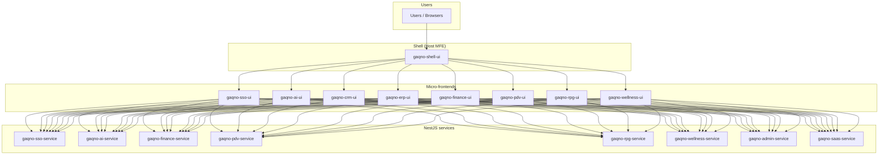
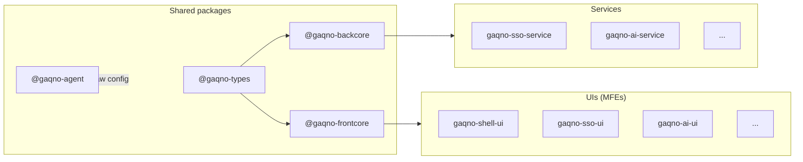
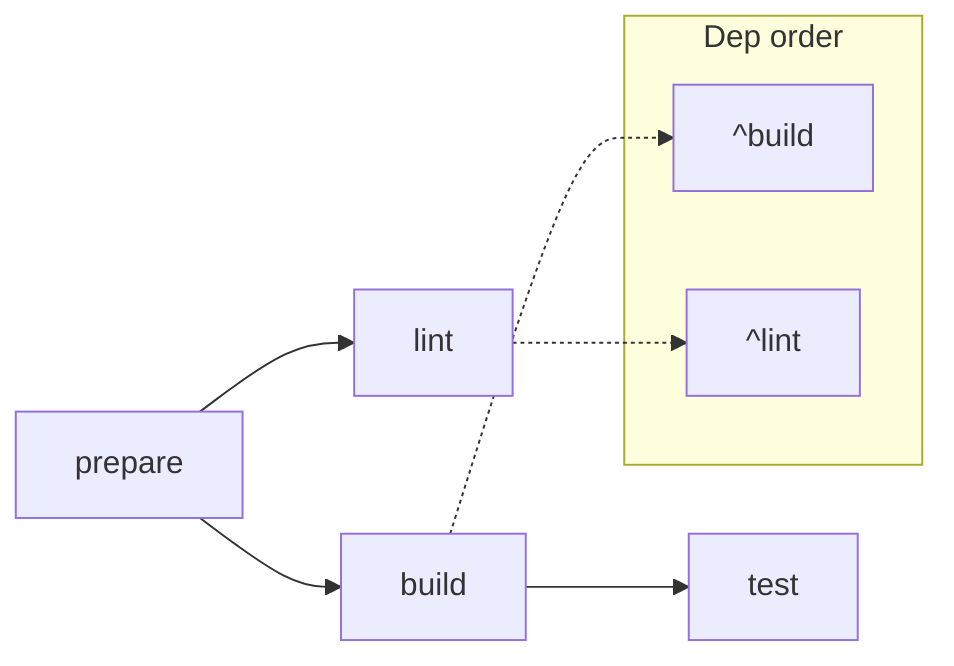
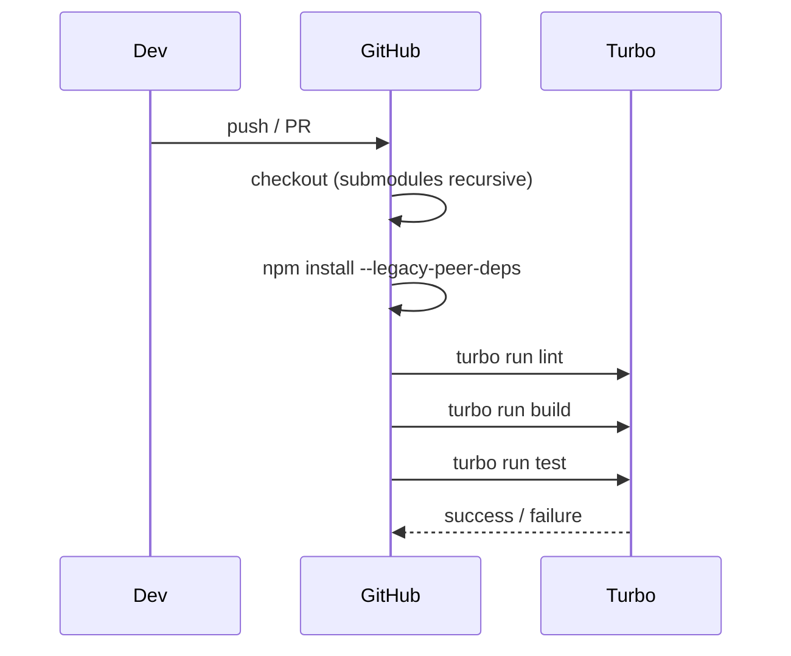

# Gaqno Development Workspace

**Monorepo** for the Gaqno platform: shared packages, NestJS services, React/Vite MFEs, and the OpenClaw agent configuration. Built with **npm workspaces** and **Turborepo** for fast, cached builds and consistent CI.

---

## Table of Contents

- [Overview](#overview)
- [Architecture](#architecture)
- [Workspace Map](#workspace-map)
- [Shared Packages](#shared-packages)
- [Services (Backend)](#services-backend)
- [UIs (Frontend MFEs)](#uis-frontend-mfes)
- [Agent](#agent)
- [Getting Started](#getting-started)
- [Scripts](#scripts)
- [CI / CD](#ci--cd)
- [Adding a New Project](#adding-a-new-project)
- [Documentation](#documentation)

---

## Overview

| Item | Description |
|------|-------------|
| **Package manager** | npm (v11.6.2) with workspaces |
| **Build orchestration** | Turborepo |
| **Backend** | NestJS 11 |
| **Frontend** | React 18, Vite, Module Federation (MFE) |
| **Shared UI** | `@gaqno-development/frontcore` (components, theme, auth) |
| **Shared backend** | `@gaqno-development/backcore` (domain, event-store, multitenancy) |
| **Types** | `@gaqno-development/types` (shared DTOs/contracts) |

Repositories are typically **git submodules**; each has its own `.github/workflows` and CI runs per repo. The workspace root CI runs lint, build, and test across all packages via Turbo.

---

## Architecture

### High-level system



### Workspace structure (packages & apps)



### Build & dev flow (Turborepo)



- **build**: `dependsOn: ["^build"]` — shared packages build first, then apps.
- **lint**: `dependsOn: ["^lint"]` — dependency packages lint first.
- **test**: `dependsOn: ["^build"]` — tests run after build.

---

## Workspace Map

| Category | Packages |
|----------|----------|
| **Shared** | `@gaqno-backcore`, `@gaqno-frontcore`, `@gaqno-types`, `@gaqno-agent` |
| **Services** | `gaqno-sso-service`, `gaqno-ai-service`, `gaqno-finance-service`, `gaqno-pdv-service`, `gaqno-rpg-service`, `gaqno-wellness-service`, `gaqno-admin-service`, `gaqno-saas-service`, `gaqno-omnichannel-service`, `gaqno-lead-enrichment-service` |
| **UIs** | `gaqno-shell-ui`, `gaqno-sso-ui`, `gaqno-ai-ui`, `gaqno-crm-ui`, `gaqno-erp-ui`, `gaqno-finance-ui`, `gaqno-pdv-ui`, `gaqno-rpg-ui`, `gaqno-wellness-ui`, `gaqno-admin-ui`, `gaqno-saas-ui`, `gaqno-omnichannel-ui`, `gaqno-landing-ui`, `gaqno-lenin-ui` |

---

## Shared Packages

| Package | Scope | Purpose |
|---------|--------|---------|
| **@gaqno-types** | `@gaqno-development/types` | Shared TypeScript types, DTOs, API contracts |
| **@gaqno-backcore** | `@gaqno-development/backcore` | NestJS shared kernel: domain, event-store, multitenancy, encryption, Kafka, OpenClaw auth |
| **@gaqno-frontcore** | `@gaqno-development/frontcore` | React shared UI: components, theme, auth, guards, layout |
| **@gaqno-agent** | `@gaqno-development/gaqno-agent` | OpenClaw agent config, workspace, skills (humanizer, summarize, GitHub, MCP bridge, etc.) |

Build shared packages from the repo root:

```bash
npm run build:types
npm run build:packages   # backcore
```

---

## Services (Backend)

NestJS 11 services. Typical ports in the 4xxx range (e.g. SSO 4001, admin 4010, saas 4009).

| Service | Role |
|---------|------|
| **gaqno-sso-service** | SSO BFF, auth, users, permissions |
| **gaqno-admin-service** | Tenant/org management, users, roles, costs/usage aggregation |
| **gaqno-saas-service** | SaaS costs aggregation (stub) |
| **gaqno-ai-service** | AI features |
| **gaqno-finance-service** | Finance module |
| **gaqno-pdv-service** | PDV (point of sale) |
| **gaqno-rpg-service** | RPG module |
| **gaqno-wellness-service** | Wellness module |
| **gaqno-omnichannel-service** | Omnichannel (e.g. WhatsApp) |
| **gaqno-lead-enrichment-service** | Lead enrichment |

Run a single service:

```bash
npm run dev:sso-service
npm run dev:ai-service
# ... etc.
```

---

## UIs (Frontend MFEs)

React 18 + Vite + **Module Federation**. The **shell** (`gaqno-shell-ui`) is the host; other apps are remote MFEs loaded at runtime.

| App | Role |
|-----|------|
| **gaqno-shell-ui** | Host app: layout, nav, loads remotes |
| **gaqno-sso-ui** | SSO / auth flows |
| **gaqno-ai-ui** | AI features |
| **gaqno-crm-ui** | CRM |
| **gaqno-erp-ui** | ERP |
| **gaqno-finance-ui** | Finance |
| **gaqno-pdv-ui** | PDV |
| **gaqno-rpg-ui** | RPG |
| **gaqno-wellness-ui** | Wellness |
| **gaqno-admin-ui** | Admin (tenants, users, roles, etc.) |
| **gaqno-saas-ui** | SaaS |
| **gaqno-omnichannel-ui** | Omnichannel |
| **gaqno-landing-ui** | Landing |
| **gaqno-lenin-ui** | (excluded from root `dev` script) |

Run the shell and one MFE:

```bash
npm run dev:shell
npm run dev:sso    # or dev:ai, dev:crm, etc.
```

Run all frontends or all backends:

```bash
npm run dev:frontends
npm run dev:backends
```

---

## Agent

**@gaqno-agent** holds the OpenClaw configuration and workspace (identity, memory, skills). Published as `@gaqno-development/gaqno-agent`. See [@gaqno-agent/README.md](@gaqno-agent/README.md) for setup (OpenClaw, ClawHub, skills, timezone).

---

## Getting Started

### Prerequisites

- **Node.js** 20+
- **npm** 11.6.2 (or compatible)

### Install

From the workspace root:

```bash
npm install --legacy-peer-deps
```

Or use the workspace script:

```bash
npm run install:all
```

### Run everything (dev)

```bash
npm run dev
```

This starts all workspaces in dev mode (except `gaqno-lenin-ui`) with Turbo. For a lighter set, use `dev:frontends` or `dev:backends`, or run a single app:

```bash
npm run dev:shell
npm run dev:sso-service
```

### Build

- **Shared packages**: `npm run build:types` then `npm run build:packages`
- **All apps (script)**: `npm run build:all`
- **Turbo (all tasks)**: `npx turbo run build`

---

## Scripts

| Script | Description |
|--------|-------------|
| `install:all` | `npm install --legacy-peer-deps` |
| `clean` | Remove all `node_modules` in workspace and packages |
| `build:types` | Build `@gaqno-types` |
| `build:packages` | Build `@gaqno-backcore` |
| `build:all` | Build shell, main MFEs and services (explicit list) |
| `dev` | Turbo dev for all packages except `gaqno-lenin-ui` |
| `dev:frontends` | Turbo dev for shell + main MFEs |
| `dev:backends` | Turbo dev for main NestJS services |
| `dev:shell`, `dev:sso`, `dev:ai`, … | Single app or service dev |
| `create-project` | Interactive script to add new UI and/or service (see [Adding a New Project](#adding-a-new-project)) |
| `list-cloudflare-dns` | List Cloudflare DNS records for gaqno.com.br (see [scripts/README.md](scripts/README.md#list-cloudflare-dnsmjs)); requires `CLOUDFLARE_API_TOKEN`. |
| `release:packages` | Run `publish-packages.sh` |
| `publish:frontcore` | Publish `@gaqno-development/frontcore` (uses `.env` for token) |
| `publish:agent` | Publish `@gaqno-development/gaqno-agent` |

### Cloudflare DNS checklist (Coolify)

Zone **gaqno.com.br**. Para listar registros (ex.: Grafana, Lenin) via API:

```bash
export CLOUDFLARE_API_TOKEN=your_token
npm run list-cloudflare-dns -- grafana lenin
```

| Hostname | O que verificar |
|----------|-----------------|
| **lenin.gaqno.com.br** | Registro A ou CNAME apontando para o destino (Coolify/túnel); proxy conforme desejado. |
| **grafana.gaqno.com.br** | Registro existe e aponta para o serviço Grafana (Coolify/túnel). |

Dashboard: [Cloudflare](https://dash.cloudflare.com) → gaqno.com.br → DNS → Records.

**502 Bad Gateway em grafana.gaqno.com.br** — DNS está ok (wildcard Tunnel `*` → GAQNO_PROD_01). O erro é entre Cloudflare e o origin. Duas opções:

1. **Via API (recomendado):** adicionar a rota no túnel com o script (requer token com permissão Cloudflare Tunnel Write):

   ```bash
   export CLOUDFLARE_API_TOKEN=seu_token
   npm run cloudflare-tunnel-add-grafana
   ```

   O script usa `CLOUDFLARE_ACCOUNT_ID` (default: conta do zone gaqno.com.br) e opcionalmente `CLOUDFLARE_TUNNEL_ID` ou `GRAFANA_ORIGIN` (default: `http://localhost:5678`).

2. **Manual:** no [Cloudflare Dashboard](https://dash.cloudflare.com) → Zero Trust ou Tunnels → túnel GAQNO_PROD_01 → Public Hostname → add `grafana.gaqno.com.br` → HTTP → `localhost:5678`.

---

## CI / CD

- **Workspace root**: [.github/workflows/ci.yml](.github/workflows/ci.yml) — on push/PR to `main`/`develop`: checkout (with submodules), install, then Turbo **lint**, **build**, **test**. Paths ignore `**/*.md` and `.cursor/**`.
- **Per-repo**: When packages are submodules, each repo has its own workflows; CI runs in the repo where the push/PR happens.



---

## Adding a New Project

Use the interactive scaffolder:

```bash
npm run create-project
```

Options (see [scripts/README.md](scripts/README.md)):

- **Type**: frontend only, backend only, or both
- **Ports**: UI dev server (e.g. 3011), NestJS (e.g. 4011)
- **Install**: run `npm install` in new packages

Then:

1. Add `MFE_{NAME}_URL` in `gaqno-shell-ui/vite.config.ts`
2. Add routes in `gaqno-shell-ui/src/App.tsx`
3. Add `VITE_SERVICE_{NAME}_URL` for the new service (if any)
4. Add `dev:{name}` and `dev:{name}-service` in root `package.json`

---

## Documentation

- **Scripts**: [scripts/README.md](scripts/README.md) — create-project, copy-workflows, list-cloudflare-dns, etc.
- **Agent**: [@gaqno-agent/README.md](@gaqno-agent/README.md) — OpenClaw setup and skills
- **GitHub / CI**: [.github/README.md](.github/README.md) — per-repo workflows
- **Confluence**: [DDS space](https://gaqno-development.atlassian.net/wiki/spaces/DDS) — product/architecture docs (`npm run publish:confluence` prints the link)

---

## Quick reference

| I want to… | Command |
|------------|--------|
| Install deps | `npm run install:all` |
| Run shell + one MFE | `npm run dev:shell` + `npm run dev:sso` (etc.) |
| Run all frontends | `npm run dev:frontends` |
| Run all backends | `npm run dev:backends` |
| Run everything | `npm run dev` |
| Build shared packages | `npm run build:types` then `npm run build:packages` |
| Add new app/service | `npm run create-project` |
| Push all submodules | `./push-all.sh` (optional message: `./push-all.sh "feat: add X"`) |

---

*Gaqno Development Workspace — monorepo for the Gaqno platform.*
