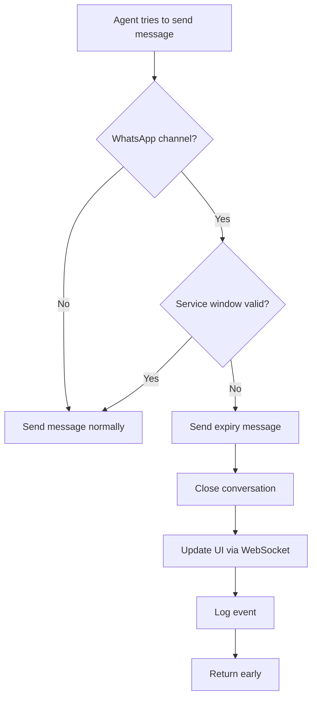

# WhatsApp Service Window Expiry Handler

## 🎯 **Objective**

When the WhatsApp 24-hour service window expires, instead of returning a 400 error, the system now automatically:
1. Sends a friendly message to the customer
2. Closes the conversation 
3. Updates the UI in real-time
4. Logs the event for analytics

## ✅ **Implementation**

### **Location**: `gaqno-omnichannel-service/src/messages/messages.service.ts`

### **Method**: Enhanced `sendMessage()` method (lines 227-261)

### **Behavior Change**:
- **Before**: Threw `BadRequestException` with 400 status
- **After**: Automatically handles expired window gracefully

## 🔄 **New Flow**



## 📱 **Customer Experience**

### **Friendly Message Sent**:
```
⏰ *Janela de serviço expirada*

Olá! O período de 24h para atendimento foi encerrado. 
Para continuar nossa conversa, por favor envie uma nova mensagem usando um *template* ou inicie uma nova conversa.

Agradecemos seu contato!
```

### **What Happens**:
1. ✅ **Customer receives clear explanation** about why conversation ended
2. ✅ **Customer knows next steps** (send template or new conversation)
3. ✅ **Conversation automatically closed** in system
4. ✅ **UI updates in real-time** for agents
5. ✅ **Event logged** for analytics

## 🔧 **Technical Details**

### **Code Changes**:
```typescript
// Before (lines 235-239):
if (!window.withinWindow) {
  throw new BadRequestException(
    "WhatsApp service window (24h) expired. Use a message template to re-open conversation."
  );
}

// After (lines 232-261):
if (!window.withinWindow) {
  // Send friendly message and close conversation automatically
  const expiredMessage = `⏰ *Janela de serviço expirada*...`;
  
  await this.appendAgentReply(tenantId, conversationId, expiredMessage);
  
  // Update conversation status to closed
  await this.db.db
    .update(conversations)
    .set({ status: "closed", updatedAt: new Date() })
    .where(eq(conversations.id, conversationId));

  // Emit WebSocket events for real-time updates
  this.ws.emitToTenant(tenantId, "conversation.updated", {
    id: conversationId,
    status: "closed",
    reason: "service_window_expired"
  });

  return; // Exit early, don't send original message
}
```

### **Database Changes**:
- **Conversation status** → `"closed"`
- **Updated timestamp** → Current time
- **System message** → Added to conversation

### **WebSocket Events**:
```typescript
// Conversation update
{
  id: conversationId,
  status: "closed",
  updatedAt: "2026-02-26T14:16:48.587Z",
  reason: "service_window_expired"
}

// System message (optional for future UI enhancements)
{
  conversationId,
  type: "service_window_expired", 
  message: "...",
  expiresAt: "...",
  lastUserMessageAt: "..."
}
```

## 📊 **Benefits**

### **✅ Improved Customer Experience**
- **No confusing 400 errors** - Clear, friendly message instead
- **Actionable guidance** - Tells customer exactly what to do
- **Professional handling** - Automatic, graceful conversation closure

### **✅ Better Agent Experience**
- **Real-time updates** - UI immediately reflects conversation status
- **Clear status** - Conversation marked as closed
- **Event logging** - Easy to track expired conversations

### **✅ Operational Benefits**
- **No manual intervention** - System handles automatically
- **Consistent handling** - Same response every time
- **Analytics ready** - Events logged for reporting

## 🔍 **Monitoring**

### **Log Messages**:
```log
[MessagesService] Conversation dc5d8794-45a5-4e5d-8ece-64c22feb9292 automatically closed due to expired service window
```

### **Metrics to Track**:
- **Expired conversations per day**
- **Time from expiry to new conversation**
- **Customer response rate to expiry messages**

## 🚀 **Future Enhancements**

### **Potential Improvements**:
1. **Template suggestions** - Suggest relevant templates based on conversation history
2. **Automatic re-engagement** - Schedule follow-up messages after 24h
3. **Analytics dashboard** - Visual metrics on expiry patterns
4. **Multi-language support** - Localized expiry messages

### **UI Enhancements**:
1. **Visual indicator** - Show expired conversations differently
2. **Quick actions** - "Re-open with template" button
3. **Time remaining** - Show countdown in active conversations

## 🎉 **Summary**

**✅ Problem Solved**: WhatsApp service window expiry no longer returns confusing 400 errors

**✅ Customer Experience**: Friendly, clear communication with actionable next steps

**✅ System Behavior**: Automatic conversation closure with real-time UI updates

**✅ Operational**: Zero manual intervention required, fully automated process

The system now gracefully handles WhatsApp service window expiry with a professional, customer-friendly approach! 🚀
